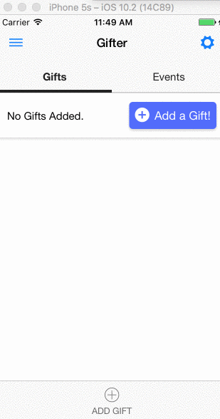

# Giftr: cloud-synced gift notepad.

------
## Development Instructions
* make sure `mongodb` is installed
* `npm install`
* run mongo daemon
  * `mongod`
* seed data
	* `npm install -g node-mongo-seeds`
	* add collectionname.json to seeds folder
	* seed
* check `package.json` for commands

## Server
* Set up environment variables
  * create a .env file in the server folder with the following properties:
  * CLIENT_ID=//e.g MYCLIENTID122r13f1
  * APP_ACCESS_TOKEN=//e.g MYCLIENTID123|MYAXXTOKEN456
  * CLIENT_SECRET=//e.g. abc123456
  * NODE_ENV=development
  * DB_HOST=//e.g mongodb://127.0.0.1:27017/giftr
  * DEV_SSL_IS_ACTIVE=false // you need to generate
  * DB_USER=//optional
  * DB_PASS=//optional
  * HTTP_PORT=//3000
  * HTTPS_PORT=//3001
  # Prod only
  * PROD_SSL_CERT_PATH=//e.g /etc/letsencrypt/archive/timeshark.org/cert1.pem
  * PROD_SSL_CA_PATH=//e.g /etc/letsencrypt/archive/timeshark.org/chain1.pem
  * PROD_SSL_PRIVKEY_PATH=//e.g /etc/letsencrypt/timeshark.org/privkey.pem
  * create a .env.test file in the test folder with the following properties
* If `DEV_SSL_IS_ACTIVE=true`, generate a self-signed key)
 ```
* `pwgen 50 1 -s > passphrase`
* `openssl genrsa -des3 -out ca.key 1024`
* `openssl req -new -key ca.key -out ca.csr`
* `openssl x509 -req -days 365 -in ca.csr -out ca.crt -signkey ca.key`
* `openssl genrsa -des3 -out server.key 1024`
* `openssl req -new -key server.key -out server.csr`
* `cp server.key server.key.passphrase`
* `openssl rsa -in server.key.passphrase -out server.key`
* `openssl x509 -req -days 365 -in server.csr -signkey server.key -out server.crt`
```
## Mongo
* [Install MongoDB](https://www.evernote.com/shard/s557/nl/2147483647/d3d477c4-fa9c-43de-8167-86eac44c801b/)

## Misc
* [Trello](https://trello.com/b/kOwrKDAC/giftr)

## Potential non-cross platform components
* CreateFriendForm -> `Modal` (react-native)
* `Swipeout`
* `DatePickerIOS`
